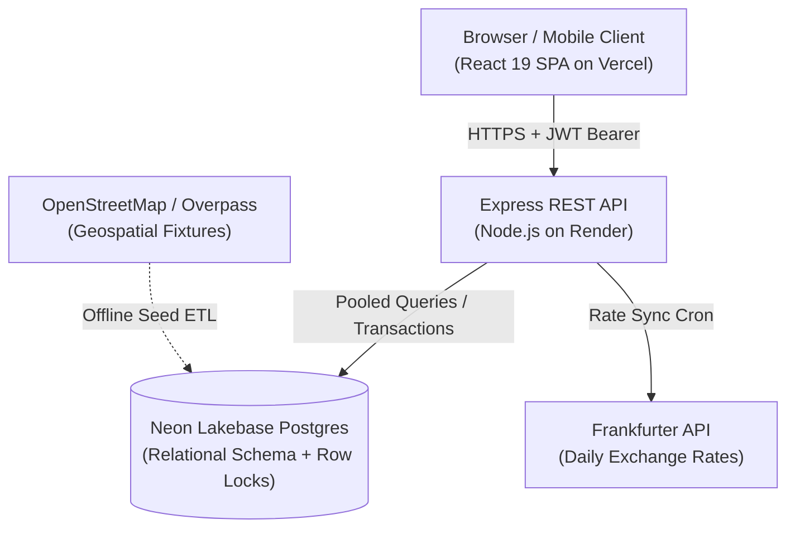

# TravelMate ✈️🏨📊

> **The Unified Travel Planning, Booking, Multi-Currency Expense Management, and Group Debt Simplification Platform.**

[](https://nodejs.org/)
[](https://react.dev/)
[](https://tailwindcss.com/)
[](https://neon.tech/)
[]()
[](LICENSE)

---

## 📌 Overview

**TravelMate** eliminates travel tool fragmentation by uniting all phases of trip management into a single, cohesive web application. From discovering hotels and booking flight seats to logging multi-currency expenses, auto-generating day-wise itineraries, and running Splitwise-style greedy debt simplification algorithms, TravelMate delivers an end-to-end travel experience designed for solo travelers and group trips alike.

Built from the ground up to operate seamlessly on zero-cost free cloud tiers (**Render**, **Vercel**, and **Neon PostgreSQL**), TravelMate incorporates enterprise-grade engineering principles including ACID row-level concurrency locks, IDOR authorization boundaries, and an automated verification suite with **391 passing assertions**.

---

## ✨ Key Features

- **🏨 Hotel Booking Module:** Discover hotels sourced from OpenStreetMap, filter by star rating/pricing, view amenities, and book directly linked to trip itineraries.
- **✈️ Transport Booking & Seat Selection:** Search flights, trains, and buses with real-time route filters. Features an interactive cabin seatmap (rows 1–30, A–F) with atomic concurrency-safe reservations and digital boarding passes.
- **💱 Dual-Currency Expense Manager:** Track trip expenses in foreign currencies (USD, EUR, GBP, AED, JPY, INR). Daily rates are synced via Frankfurter (European Central Bank), with immutable `amount_base` snapshots preserving historical accuracy.
- **🤝 Splitwise Debt Simplification:** Split group expenses equally or via custom allocations. A greedy $O(N \log N)$ algorithm simplifies complex multi-party debt webs into minimal transactions.
- **📅 Auto-Linked Itinerary Planner:** Automatically populates confirmed flight and hotel bookings into day-by-day activity timelines with reordering.
- **💡 Travel Intelligence:** Cost Estimator forecasts total spend against budget, and Recommender scores options according to travel styles (`cheapest`, `balanced`, `comfort`).
- **⭐ Verified Reviews & Notifications:** Verified review system restricted to completed bookings, accompanied by an in-app notification center.

---

## 🏗️ Architecture



---

## 🚀 Quickstart (Local Development)

### 1. Prerequisites
- Node.js (v18+)
- Neon PostgreSQL connection string (or local PostgreSQL)

### 2. Backend Setup
```bash
cd backend
cp .env.example .env
# Edit .env with your Neon DATABASE_URL and JWT_SECRET
npm install
npm run db:migrate    # Run schema migrations
npm run db:indexes    # Apply performance B-tree indexes
npm run db:seed       # Seed stations, hotels, and transport
npm run dev           # Start server on http://localhost:5000
```

### 3. Frontend Setup
```bash
cd ../frontend
npm install
npm run dev           # Start Vite dev server on http://localhost:3000
```

### 4. Running Verification Test Suite
```bash
cd backend
npm test              # Run all 391 automated test assertions
npm run test:jest     # Run Jest & Supertest integration suite
```

---

## 🌐 Production Deployment

### Backend (Render)
1. Fork or push this repository to GitHub.
2. In [Render Dashboard](https://dashboard.render.com), click **New > Blueprint** and select your repository (it will automatically detect [`render.yaml`](render.yaml)).
3. Fill in secret environment variables:
   - `DATABASE_URL`: Your Neon PostgreSQL connection string (with `?sslmode=require`).
   - `CORS_ORIGIN`: Your Vercel frontend domain (`https://<your-app>.vercel.app`).
4. Render deploys the backend with built-in health check monitoring at `/api/health`.

### Frontend (Vercel)
1. In [Vercel Dashboard](https://vercel.com), import the Git repository.
2. Set Root Directory to `frontend`.
3. Add Environment Variable:
   - `VITE_API_URL`: `https://<your-render-api-name>.onrender.com/api`
4. Deploy! SPA URL rewrites are pre-configured in [`frontend/vercel.json`](frontend/vercel.json).

---

## ⚡ Keep-Alive & Free-Tier Resilience

Render free web services spin down after 15 minutes of inactivity. To prevent cold starts during demos or presentations:
- Review the [**Keep-Alive & Free-Tier Guide**](docs/KEEPALIVE_GUIDE.md).
- Use the built-in warm-up script:
  ```bash
  npm run keepalive https://<your-render-app>.onrender.com
  ```
- Or enable the included [GitHub Actions Keep-Alive Workflow](.github/workflows/keepalive.yml).

---

## 🎓 Academic Viva & Documentation

For examiners, evaluators, and project documentation:
- 📖 [**Full Project Engineering Report**](docs/PROJECT_REPORT.md) — Comprehensive SRS, Architecture, DFD Level 0 & 1, ER Diagram, Concurrency Locks, and Security Threat Model.
- 🎤 [**7-Minute Viva Presentation Script**](docs/VIVA_PRESENTATION_SCRIPT.md) — Timed walkthrough script, demo personas, examiner defense Q&A, and fallback strategies.
- 📋 [**Living Decision Record (ADRs)**](DECISIONS.md) — Full log of all architectural decisions and phase milestones from Phase 0 to Phase 11.

---

## 📜 Attributions & License

- Hotel and geospatial data: © [OpenStreetMap contributors](https://www.openstreetmap.org/copyright) (ODbL).
- Currency reference data: [Frankfurter](https://www.frankfurter.app/) (European Central Bank).
- Icons: [Lucide](https://lucide.dev/) (ISC License).

Licensed under the [ISC License](LICENSE).
