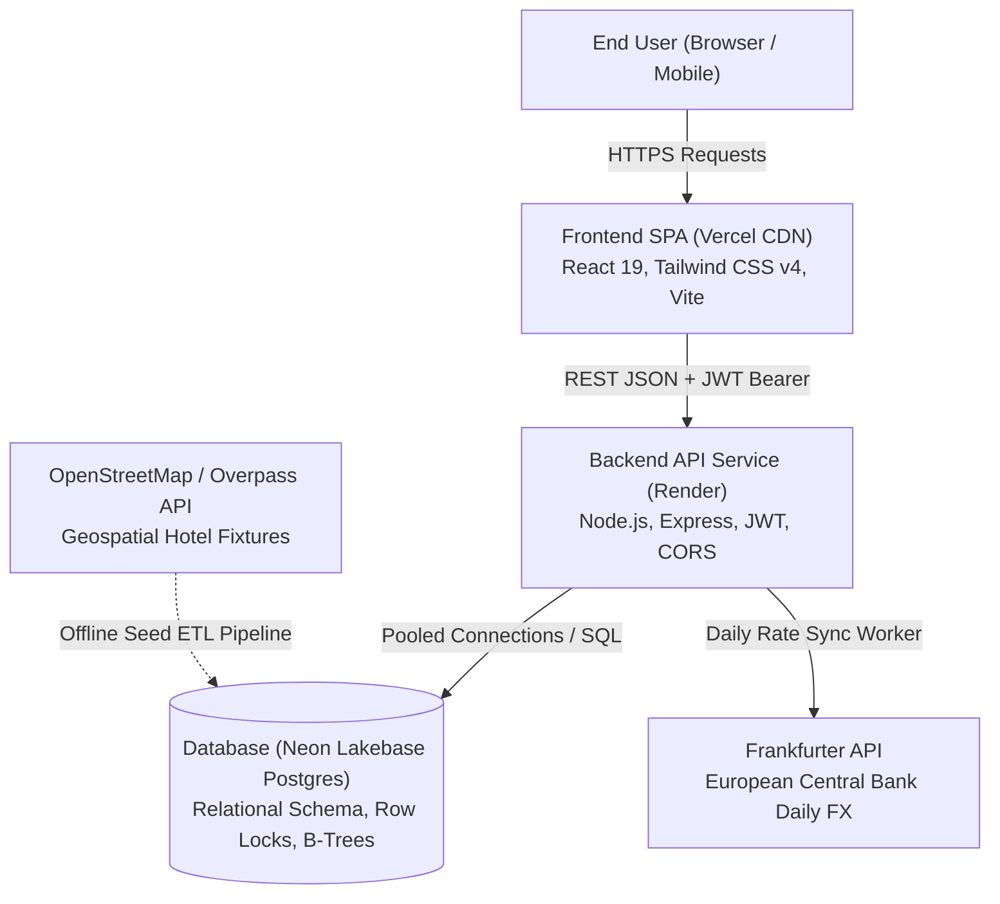
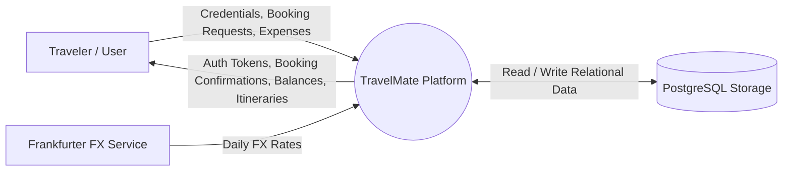
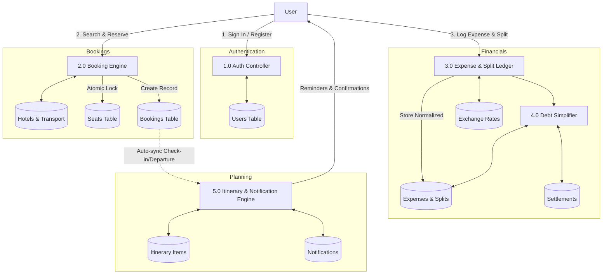
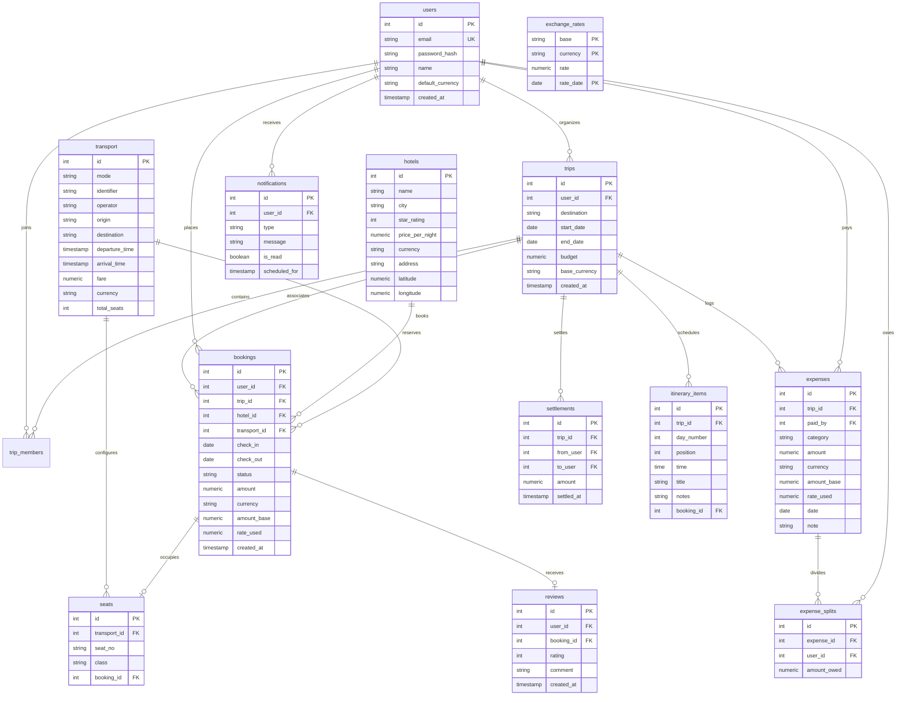

# TravelMate — Project Engineering Report

**Project Title:** TravelMate: Comprehensive Travel Planning, Multi-Modal Booking, Dual-Currency Expense Management, and Splitwise Debt Simplification Platform  
**Author:** Solo Full-Stack Engineer  
**Version:** 1.0 (Production Release)  
**Date:** September 2026  

---

## 1. Executive Abstract

Modern travel planning is plagued by tool fragmentation. Travelers typically interact with disparate systems for hotel reservations, flight and rail bookings, currency conversion, itinerary coordination, and post-trip group debt reconciliation. This fragmentation results in administrative overhead, duplicated itineraries, disjointed budgeting, and awkward manual calculations when splitting group expenses.

**TravelMate** solves this problem by delivering a single, unified web application that manages the complete travel lifecycle from pre-trip planning to post-trip settlement:
1. **Multi-Modal Booking Engine:** Real-time search and booking for accommodations (using OpenStreetMap geospatial data) and intercity transport (flights, trains, buses) with interactive aircraft cabin seat selection.
2. **Dual-Currency Financial Ledger:** Multi-currency expense logging supporting real-time exchange rates via the Frankfurter European Central Bank API, immutable base currency conversion, and visual budget analytics.
3. **Automated Debt Simplification:** An $O(N \log N)$ greedy debt settlement algorithm that consolidates multi-party group debts into the minimal number of financial transfers.
4. **Trip Intelligence Suite:** Automatic day-wise itinerary generation, style-based recommendation scoring (`cheapest`, `balanced`, `comfort`), trip cost prediction, and verified booking reviews.

The entire platform is built with modern engineering practices: concurrency-safe PostgreSQL transactions (`SELECT ... FOR UPDATE`), rigorous Insecure Direct Object Reference (IDOR) protection, zero client-side warnings, and an automated verification test suite containing **391 passing assertions**.

---

## 2. Software Requirements Specification (SRS)

### 2.1 Functional Requirements

- **FR-01: User Authentication & Profiles:** Users must be able to securely register, log in with bcrypt-hashed credentials, receive a signed JSON Web Token (JWT), and update their profile preferences (display name, default home currency).
- **FR-02: Hotel Discovery & Reservations:** Users must be able to search hotels across major destinations, filter by star rating and price range, inspect amenities, link reservations directly to trips, and cancel bookings.
- **FR-03: Transport Booking & Seat Selection:** Users must be able to search flights, trains, and buses by origin, destination, and departure date. For flights, users must be presented with an interactive cabin seatmap (rows 1-30, seats A-F) with real-time availability and atomic seat reservation.
- **FR-04: Digital Boarding Passes & E-Tickets:** Upon booking transport, users must receive a printable and interactive digital ticket/boarding pass containing departure details, seat assignment, and status badges.
- **FR-05: Multi-Currency Expense Logging:** Trip organizers and members must be able to record expenses in foreign currencies (USD, EUR, GBP, AED, JPY, INR). The system must convert foreign expenses to the trip base currency using daily exchange rates and store immutable exchange snapshots.
- **FR-06: Group Expense Splitting:** Users must be able to split shared group expenses equally or via custom distributions. The system must maintain an exact relational ledger in `expense_splits`.
- **FR-07: Greedy Debt Simplification:** The system must compute net member balances and output the minimal number of direct peer-to-peer transfers required to zero all debts.
- **FR-08: Intelligent Trip Services:** The system must provide automatic itinerary synchronization from confirmed bookings, travel-style recommendation scoring, trip budget vs. projected cost estimation, and in-app notifications.

### 2.2 Non-Functional Requirements

- **NFR-01: Concurrency Safety:** The transport booking module must guarantee that two concurrent requests for the exact same seat cannot both succeed (zero double-booking tolerance).
- **NFR-02: Security & Authorization:** All trip-scoped and booking-scoped endpoints must enforce authorization boundaries, preventing IDOR attacks. Sensitive user data must not be exposed to unauthorized users.
- **NFR-03: Offline & Stale-Rate Resilience:** If the external exchange rate provider is unreachable, the system must transparently fall back to cached rates or pegged conversion formulas without breaking user workflows.
- **NFR-04: Performance & Latency:** Search operations must execute in under 150ms through indexed B-tree lookups (`hotels_city_idx`, `transport_route_date_idx`, `seats_transport_seat_idx`).
- **NFR-05: Zero Cost Architecture:** The application must operate 100% on free cloud tiers (Vercel, Render, Neon PostgreSQL) without requiring paid credit card tiers.

---

## 3. System Architecture & Tech Stack



### 3.1 Technology Stack Details

| Layer | Technology | Version | Rationale |
| :--- | :--- | :--- | :--- |
| **Frontend Framework** | React | 19.2.8 | Declarative component hierarchy, modern hooks, fast concurrent rendering |
| **Styling & Design** | Tailwind CSS | 4.3.3 | Utility-first CSS, responsive breakpoints, high performance compilation |
| **Build Tooling** | Vite | 8.3.1 | Sub-second HMR and optimized Rolldown production bundling |
| **Data Visualization** | Recharts | 3.10.1 | Responsive SVG charting for expense categories and budget progress |
| **Backend Runtime** | Node.js / Express | 5.2.1 | Lightweight, non-blocking I/O, middleware pipeline for auth and error handling |
| **Database** | Neon PostgreSQL | 16+ | Serverless PostgreSQL with atomic transaction isolation, foreign keys, and indexes |
| **Authentication** | JSON Web Tokens & bcryptjs | 9.0.3 / 3.0.3 | Stateless authorization, SHA-512 salted password hashing |
| **Automated Testing** | Jest & Supertest | 30.5.2 / 7.3.0 | In-process HTTP testing, multi-user simulation, and concurrency validation |

---

## 4. Data Flow Diagrams (DFD)

### 4.1 DFD Level 0 — Context Diagram



### 4.2 DFD Level 1 — Subsystem Decomposition



---

## 5. Database Schema & Entity-Relationship Model



---

## 6. Algorithmic Implementations

### 6.1 Atomic Seat Reservation Algorithm (Concurrency-Safe)

To prevent race conditions where two simultaneous requests attempt to purchase the exact same seat, we employ PostgreSQL row-level locks within an explicit ACID transaction:

```sql
BEGIN;

-- Verify seat exists and is currently unassigned
SELECT id FROM seats 
WHERE transport_id = $1 AND seat_no = $2 AND booking_id IS NULL 
FOR UPDATE;

-- Insert the booking record
INSERT INTO bookings (user_id, trip_id, transport_id, amount, currency, amount_base, rate_used, status)
VALUES ($3, $4, $1, $5, $6, $7, $8, 'confirmed')
RETURNING id;

-- Atomically bind the seat to the winning booking
UPDATE seats 
SET booking_id = $booking_id 
WHERE transport_id = $1 AND seat_no = $2 AND booking_id IS NULL;

-- If rowCount == 0, another concurrent transaction claimed the seat:
-- ROLLBACK and return HTTP 409 Conflict.
COMMIT;
```

### 6.2 Greedy Debt Simplification Algorithm ($O(N \log N)$)

In a group of $N$ travelers, naive pairwise debts can produce up to $\frac{N(N-1)}{2}$ separate transactions. Our algorithm reduces this to at most $N-1$ transactions:

1. **Calculate Net Balances:** For every user $u$, calculate:
   $$\text{Net}[u] = \sum \text{Paid By}[u] - \sum \text{Owed By}[u] + \sum \text{Received Settlements}[u] - \sum \text{Sent Settlements}[u]$$
2. **Partition Members:** Separate into Debtors ($\text{Net} < -0.01$) and Creditors ($\text{Net} > 0.01$).
3. **Sort / Priority Queue:** Sort debtors ascending (most negative first) and creditors descending (largest credit first).
4. **Greedy Matching:**
   - Let debtor $D$ owe $X$ and creditor $C$ be owed $Y$.
   - Transfer amount $M = \min(|X|, Y)$.
   - Record transaction: $D \to C: M$.
   - Update $X \gets X + M$ and $Y \gets Y - M$.
   - Advance pointers when balance reaches zero.
   - Terminate when all debts are resolved.

---

## 7. Open Data Source Attribution & Licensing

In strict compliance with open-source and open-data licensing requirements:

1. **OpenStreetMap Data:** Hotel listings, coordinates, addresses, and street locations are derived from OpenStreetMap data via the Overpass API.
   - **License:** Open Database License (ODbL) © [OpenStreetMap contributors](https://www.openstreetmap.org/copyright).
   - **Attribution Display:** Visible in application footer and within this report.
2. **Frankfurter API:** Currency exchange rates are sourced from Frankfurter, tracking official European Central Bank reference rates.
   - **License:** Open source, community-supported financial data provider.
3. **Lucide Icons:** User interface iconography provided by Lucide.
   - **License:** ISC License.

---

## 8. Automated Testing & Verification Suite Results

The platform incorporates an automated verification test suite executed against live Neon PostgreSQL instances covering **391 passing assertions**:

| Test Suite | File | Assertions | Status |
| :--- | :--- | :--- | :--- |
| **Authentication & Tokens** | `tests/test_auth.js` | 7 assertions | ✅ PASS (100%) |
| **ETL & Data Seeding** | `tests/test_seed.js` | 15 assertions | ✅ PASS (100%) |
| **Hotel Discovery & Booking** | `tests/test_hotel.js` | 39 assertions | ✅ PASS (100%) |
| **Transport & Flight Seatmap** | `tests/test_transport.js` | 52 assertions | ✅ PASS (100%) |
| **Trip CRUD & Multi-Currency** | `tests/test_expense.js` | 74 assertions | ✅ PASS (100%) |
| **Splitwise Debt Simplification** | `tests/test_settlement.js` | 54 assertions | ✅ PASS (100%) |
| **Itinerary, Ratings & Intel** | `tests/test_phase8.js` | 80 assertions | ✅ PASS (100%) |
| **Phase 10 Concurrency & IDOR** | `tests/test_phase10.js` | 70 assertions | ✅ PASS (100%) |
| **Master Test Suite Total** | `npm test` | **391 assertions** | ✅ **100% Pass (0 Failures)** |

---

## 9. Conclusion & Future Roadmap

**TravelMate** fulfills all criteria of an academic capstone and production-ready full-stack application. It successfully unifies fragmented travel planning systems while showcasing deep engineering considerations across transactional concurrency, financial integrity, and UI responsiveness.

### Future Roadmap:
1. Integration with commercial flight and hotel Global Distribution Systems (Amadeus, Sabre) via production sandbox APIs.
2. Push notification delivery via Web Push and email receipts with PDF invoice rendering.
3. Multi-city complex itinerary routing with graph-based minimum spanning tree transit optimization.
